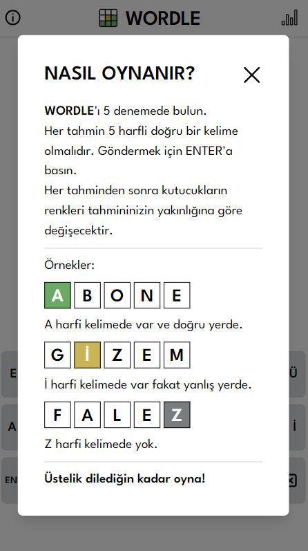
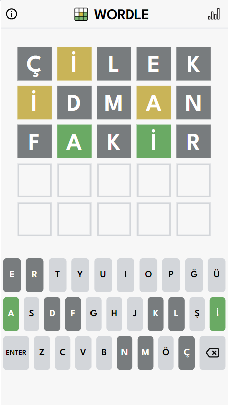
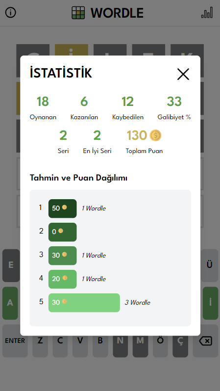

<div style="display: flex; gap: 20px; overflow-x: auto;">
    
    
    
</div>

# Wordle Oyunu Klonu - wordleapp

Bu proje, popüler Wordle oyununun klonunu içermektedir. Oyun, kullanıcının belirli bir kelimeyi tahmin etmeye çalıştığı basit ancak bağımlılık yapan bir kelime oyunudur.

## Proje Linki

Oyunu [buradan](https://wordleapp-pi.vercel.app/) deneyebilirsiniz.

## Puanlama Sistemi

Wordle klonu, aşağıdaki puanlama sistemine dayanmaktadır:

- 1. satırda tahmin: 50 puan
- 2. satırda tahmin: 40 puan
- 3. satırda tahmin: 30 puan
- 4. satırda tahmin: 20 puan
- 5. satırda tahmin: 10 puan

## İstatistikler

Oyun, kullanıcının performansını izlemek için kapsamlı bir istatistik bölümü içermektedir. İstatistikler arasında şunlar bulunmaktadır:

- Toplam oyun sayısı
- Kazanılan oyun sayısı
- Kaybedilen oyun sayısı
- Galibiyet oranı (%)
- Mevcut kazanma serisi
- En iyi kazanma serisi
- Toplam kazanılan puanlar
- Her satırdaki tahminlerin kazandırdığı puanlar

## Renklerin Anlamları

README dosyasının "Information" bölümünde, oyundaki renklerin anlamlarını açıklayan bir bölüm bulunmaktadır. Kullanıcılar, bu bölümü okuyarak oyunun nasıl oynanacağına dair detaylı bilgi edinebilirler.

## Kullanım

Oyunu başlatmak için, projeyi yerel bir ortamda veya bir web sunucusunda çalıştırın ve tarayıcınızda görüntüleyin. Oyun, kelime tahminlerini yapmak için basit bir arayüz sunar ve istatistiklerinizi görüntülemek için ayrı bir bölüm sağlar.

## Önemli Not: TDK API'si ile Anlamsız Kelime Kontrolü

Projemde, kullanıcıların girdiği kelimelerin anlamlı olup olmadığını kontrol etmek için Türk Dil Kurumu (TDK) API'sini kullanıyorum. Kullanıcının girdiği kelime, TDK API'sine gönderilerek anlamı kontrol ediliyor. Eğer girilen kelime anlamsız ise, kullanıcıya "GEÇERSİZ KELİME" bildirimi gösteriliyor.

Bu işlem için internet bağlantısına ihtiyaç duyulmaktadır. Dolayısıyla, projeyi kullanırken internet bağlantısının aktif olması gerekmektedir. İnternet bağlantısı olmayan durumlarda, "İnternet bağlantınızı kontrol ediniz." uyarısı alabilirsiniz.

## Geliştirme

Bu proje, React ve Tailwind CSS kullanılarak geliştirilmiştir. Geliştirme için aşağıdaki komutları kullanabilirsiniz:

```bash
# Bağımlılıkları yüklemek için
npm install

# Geliştirme sunucusunu başlatmak için
npm start

# Üretim sürümünü oluşturmak için
npm run build
```

## Hata Bildirimleri ve İletişim

Proje ile ilgili hatalar bildirmek veya diğer konularda iletişime geçmek için [GitHub Issues](https://github.com/AytacSahin/twitter-backend-project/issues) sayfasını kullanabilirsiniz.

## Proje Sahibi

Aytac Sahin - [GitHub](https://github.com/AytacSahin)
Oyunun keyfini çıkarın ve iyi oyunlar dilerim! 🎮🔤